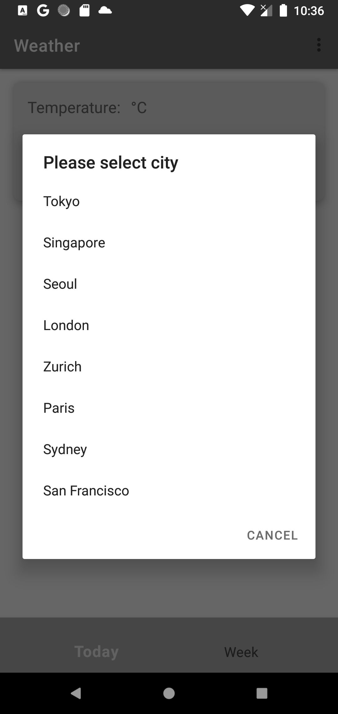
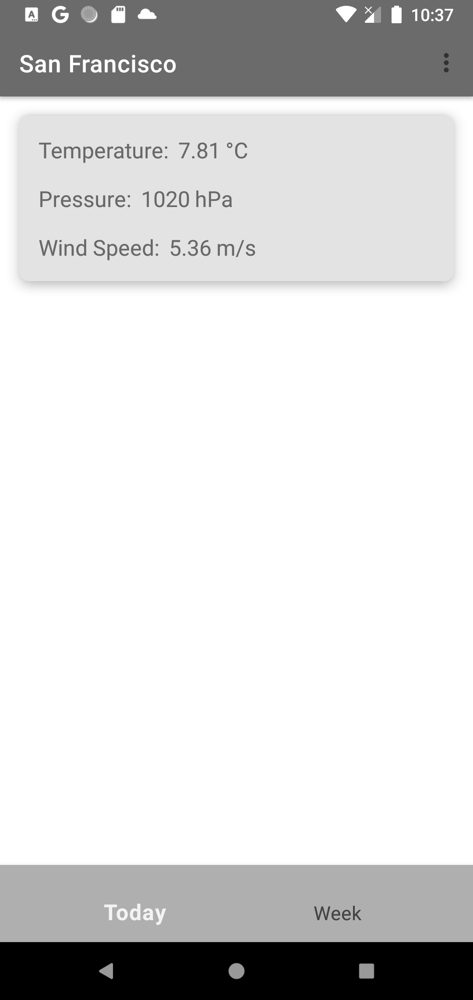

# Weather
A simple weather app that displays the current weather and a 5-day forecast using the OpenWeatherMap API.

##
Features
Loading Screen: Upon launching the app, a loading screen with a logo is displayed.
Tab Navigation: The main screen contains two tabs: "Today" and "Week."
Today Screen: The "Today" tab displays the current weather information for the selected city. The app features a toolbar with the city name and a button to choose a city from a hardcoded list.
Week Screen: The "Week" tab displays a 5-day forecast for the selected city, showing the day of the week along with the minimum and maximum temperatures.
Caching and Offline Support: The app caches the fetched weather data and displays the results even when offline.

##
Implementation Details
The app is built using the following technologies:

Kotlin as the programming language
Retrofit for making API calls
Hilt for dependency injection
Kotlin Coroutines for async and background tasks
Room for data persistence and caching
MVVM architecture pattern

## 
Screenshots

## 
Installation
Clone the repository: git clone https://github.com/abetx10/Weather.git
Open the project in Android Studio
Run the app on an emulator or a physical device
Note: To use the OpenWeatherMap API, you'll need to obtain an API key and add it to the project.
